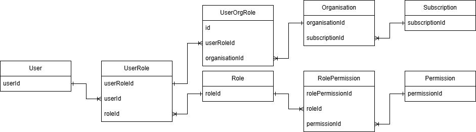

 MySQL RDS 

  1. Create AWS Access Key ID and Secret Access Key on AWS Console
  (https://youtu.be/07jkKa7oYMs)
  
  2. Configuring AWS Access Key ID and Secret Access Key on Terraform Clud
  (https://youtu.be/rY-VPn5HiyE)
  
  3. Deploying MySQL in us-east-1 (North Virginia)
  (https://youtu.be/fiElOPI54f4)

 Entity-Relation 

 LINQ in C# 

* Where()
* Select()
* OrderBY()
* Count()
* Take()
* Min()
* Max()
* Last()
* ToList()
* All()
* GroupBy()
* Any()
* FirstOrDefault()
* Sum()
* Distict()
* Average()
* Reverse()
* ToDictionary()
* ToArray()
* Single()

 Entities 

* DiagnosticTroubleCode.cs
* Driver.cs
* Maintenance.cs
* Organization.cs
* Permission.cs
* Role.cs
* RolePermission.cs
* Subscription.cs
* TenantEntity.cs
* User.cs
* UserOrganisationRole.cs
* VehicleType.cs

